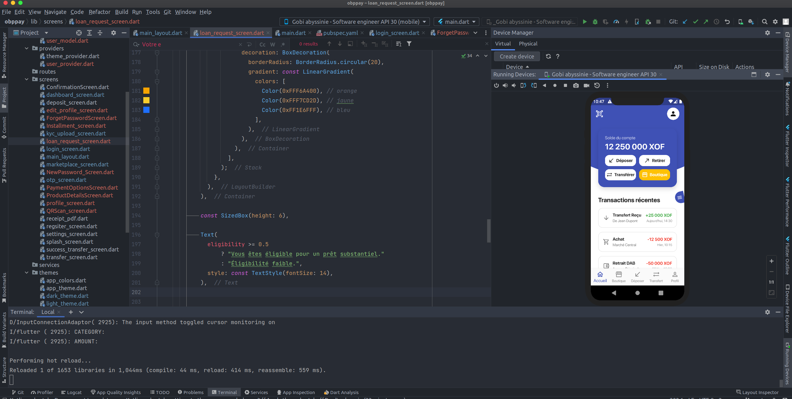
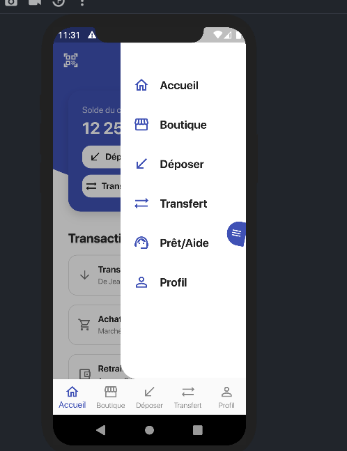
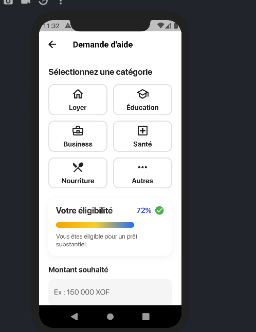

# 💳 OBPPay — Mobile Money & Digital Wallet App

OBPPay is a modern **mobile money & digital wallet application** designed for fast, secure, and intuitive financial operations.  
The project includes wallet management, transfers, deposits, marketplace interactions, loan requests, and a premium onboarding experience.

Built entirely with **Flutter**, OBPPay provides a smooth user experience and a scalable architecture ready for production.

---

## 🚀 Features

### 🏦 **Wallet & Account Management**
- View account balance in real time
- Recent transactions list
- Action shortcuts (Deposit, Withdraw, Transfer, Marketplace)

### 💰 **Money Operations**
- Deposit & withdraw
- Transfer funds to other users
- Clean UI for all transaction types

### 🛒 **Marketplace Module**
- Browse and buy digital/physical items
- Integrated storefront view

### 📲 **Slide-In Curved Drawer Menu**
- Curved animated drawer
- Rotating hamburger menu button
- Navigation shortcuts
- Supports extra pages (e.g., Loan Requests)

### 📝 **Loan Request System**
- Choose a loan category
- Support for custom ("Other") categories
- Eligibility evaluation with a **premium gradient bar**
- Amount field shown only when eligible
- Ready for backend integration

### 🎯 **Quick Tour / Onboarding**
Using `showcaseview`, OBPPay guides new users through key features:
- Menu button
- Wallet balance
- Deposit & Transfer actions
- Can be shown only at first launch (configurable)

### 🌙 **Dark & Light Mode**
- Fully responsive themes
- Managed globally using Provider

---

## 📁 Project Structure

```
lib/
│
├── main.dart                       # App entry point
├── themes/                         # Light & dark theme definitions
├── providers/                      # Theme & user state providers
│
├── screens/
│   ├── splash_screen.dart          # Initial splash screen
│   ├── dashboard_screen.dart       # Main wallet dashboard
│   ├── deposit_screen.dart         # Deposit money
│   ├── transfer_screen.dart        # Transfer money
│   ├── marketplace_screen.dart     # Marketplace
│   ├── profile_screen.dart         # User profile
│   ├── loan_request_screen.dart    # Loan/aide request module
│   ├── main_layout.dart            # Home screen with bottom nav & drawer
│
├── widgets/                        # Reusable components (optional)
└── themes/                         # App color scheme & styles
```

---

## 🛠️ Technologies

| Technology         | Purpose                         |
|-------------------|---------------------------------|
| **Flutter**       | Cross-platform mobile app       |
| **Provider**      | State management                |
| **ShowCaseView**  | Quick tour / onboarding         |
| **Dart**          | Core language                   |
| **Custom Animations** | Drawer, gradient bars     |
| **Material UI**   | Base components                 |

---

## 🎨 UI & Design Highlights

- Custom curved right-side drawer
- Smooth animations
- Premium gradient eligibility bar
- Professional layout, spacing, and shadows
- Modern rounded UI components

---

## 🧠 State Management

OBPPay uses **Provider** to manage:

- Theme switching
- User session
- Future modules (auth, loan logic, transactions, etc.)

Providers are initialized in `main.dart` using `MultiProvider`.

---

## 💡 Quick Tour (Onboarding)

The quick tour highlights key elements of the app.

### Highlighted elements:
- Hamburger menu
- Wallet balance
- Deposit button
- Transfer button

### How it works:
1. Keys are defined in `MainLayout`
2. Widgets are wrapped using `Showcase()`
3. `startShowCase()` is called after the first render
4. (Optional) Use `SharedPreferences` to show it only once

---

## 📦 Installation & Setup

### 1. Clone the repo

```bash
git clone https://github.com/<username>/obppay.git
cd obppay
```

### 2. Install dependencies

```bash
flutter pub get
```

### 3. Run the app

```bash
flutter run
```

### 4. (Optional) Build APK

```bash
flutter build apk
```

---

## 🔌 Backend Integration

OBPPay integrates easily with any backend: Laravel, Node.js, Django, etc.

Common endpoints include:

- `/auth/login`
- `/wallet/balance`
- `/wallet/transactions`
- `/transfer/send`
- `/loan/request`

Networking can be implemented with:

```dart
http
dio
retrofit
```

---

## 🔐 Security Considerations

- OTP for sensitive operations
- Token storage using Provider + secure storage (recommended)
- HTTPS for all API requests
- Proper validation on backend

---

## 🎯 Roadmap

Planned features:

- 🔐 OTP login
- 📍 Nearby OBP agencies
- 🧾 Transaction receipts (PDF)
- 📊 Loan eligibility scoring system
- 🔔 Push notifications
- 🌐 Full backend integration
- 💳 Virtual card module

---

## 👨‍💻 Author

**Gobi-a P. Ahonon**  
Software Engineering • Machine Learning • AI Researcher  
🇨🇭 Based in Switzerland (and based 🇺🇸 US) • 🇧🇯 From Benin  
📘 Passionate about fintech, intelligent systems & UX design

---

## ⭐ Contribution

Contributions are welcome!  
Please follow the code style and PR structure.

---

## 📜 License

MIT License © 2025 OBPPay

---

## 📱 Screenshots

### Dashboard


### Side Menu


### Loan Request Screen

